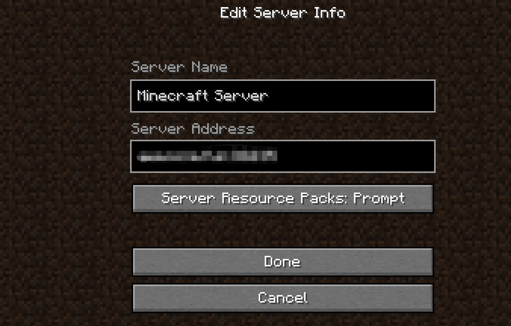

# 💡 准备工作


**GitBook tip:** A succinct video overview is a great way to introduce folks to your product. Embed a Loom, Vimeo or YouTube video and you're good to go! We love this video from the fine folks at Loom as a perfect example of a succinct feature overview.


## 启动器

嘿朋友，我想你应该先下载游戏，不是吗？

这很简单，你可以选择官方启动器，但是我不推荐它       &#x20;

我推荐你使用第三方的启动器，因为它们可以帮助你快速的构建游戏版本，我个人使用的是baka启动器，你可以自行寻找好用的启动器

## 游戏

哈哈，恭喜你 你已经下好启动器了，接下来，我们在启动器里下载1.19.2的Minecraft游戏

下载好了吗？好的，进入游戏吧！

<figure><figcaption>
1
</figcaption></figure>

1.点击添加服务器

<figure><figcaption>
2
</figcaption></figure>

2.在地址栏中填入在qq群里获得的ip地址
